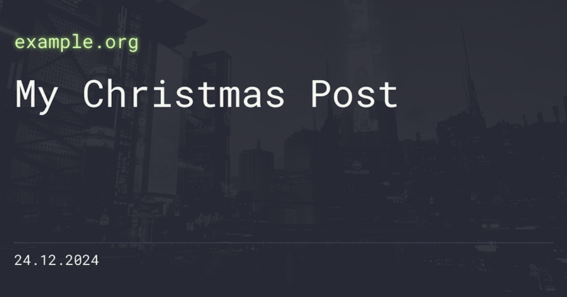

# Open Graph Image Creator
Simple web service for creating dynamic [Open Graph](https://ogp.me) images. I made this for myself to use with [Hugo](https://gohugo.io), but feel free to use it if you find it useful!




## Prerequisites
- [Docker](https://www.docker.com)

## How to run
The application is designed to be run as a [Docker](https://www.docker.com) container.

1) Copy `config.yaml.example` to `config.yaml` and check the configuration
2) Copy `docker-compose.yaml.example` to `docker-compose.yaml`
3) Copy `template.html.example` to `template.html`
4) Create `/static` directory and `/static/style.css` file
5) Create `/cache` directory
6) Design your image ([documentation](#how-to-design-your-image))
7) Start the container: `docker container up -d`

By default, the application will listen on port **8080**: http://localhost:8080. Edit `docker-compose.yaml` if you want to change the port.

## Configuration
Configuration file: `config.yaml`

- `site`: Default site value if no `site` URL parameter is provided
- `secret`: If set, a matching `secret` URL parameter is required to view the preview and to generate the image.
- `date_format`: The date field will be set to the current time if the URL parameter is not provided. This setting specifies the date format. It uses [Go's date format syntax](https://gosamples.dev/date-time-format-cheatsheet/).
- `max_cache`: Maximum time the image can be cached. The value is used in the `Cache-Control` header.
- `line_break_characters`: Characters or strings that will be replaced with line breaks. Read more below.
- `cache_dir`: Image cache directory (relative to project path)

## How to use
Once the application is running, you can see the HTML preview in http://localhost:8080.

You can change the `title`, `site` and `date` using URL parameters, for example [http://localhost:8080?title=My%20Christmas%20Post&site=mysite.com&date=2024-12-24](http://localhost:8080?title=My%20Christmas%20Post&site=mysite.com&date=2024-12-24).

URL parameters are treated as strings and they are not parsed. This means that all fields, including `date` can contain any text.

When your design is ready, you can get the actual PNG image from http://localhost:8080/opengraph.png. As with the preview, you can change the content using the URL parameters: [http://localhost:8080/opengraph.png?title=My%20Christmas%20Post&site=mysite.com&date=2024-12-24](http://localhost:8080/opengraph.png?title=My%20Christmas%20Post&site=mysite.com&date=2024-12-24)

It is **NOT** recommended to use these images directly as it is slow and wastes resources. Generate the image once and then make a local copy or use some kind of caching mechanism.

### Controlling line breaks
Sometimes blog posts have titles that are so long that they need to be split into two lines. For me personally, this often happens with posts that have two-part titles, such as *"Travel Diary: 1st Day"*.

Depending on your font size, this is what it might look like:
```
Travel Diary: 1st
Day
```

Ugly! There is a `line_break_characters` configuration which allows you to specify certain characters or strings to be converted to line breaks.

For example, if `line_break_characters` contains a string `: ` (colon with space), the previous example will look like this:
```
Travel Diary:
1st Day
```

Much better! Only the first instance of the string is replaced. If you have a post titled *"Game Review: Horizon: Forbidden West"*, the second colon will not be replaced and it will look like this:
```
Game Review:
Horizon: Forbidden West
```

## How to design your image

### HTML template
The [default template](template.html.example) probably contains all the HTML you need. It is as super simple:
```html
<body>
    <div class="opengraph">
        <div class="title"><span>{{ .Title }}</span></div>
        <div class="site"><span>{{ .Site }}</span></div>
        <div class="date"><span>{{ .Date }}</span></div>
    </div>
</body>
```

If you need to tweak it, feel free to do so. The template uses [Go's template syntax](https://docs.gomplate.ca/syntax/). The template **must** have an element with `opengraph` class. This element is the root of the Open Graph image.

There are only three **string** variables available:
- `Title` - Title of the post
- `Site` - Name or URL of the site
- `Date` - Date when the post was published

### Styles
Simply define your styles in `/static/style.css`. If you need any static files, such as images or fonts, add them to the `/static` directory as well.

You can design your image however like, but remember, that the final image will be the same size as the element with the `opengraph` class. So, set a fixed width and height in your style definition:

```css
.opengraph {
    width: 1200px;
    height: 630px;
}
```

### JavaScript
Yes, you can use JavaScript! This allows you to do some fancy stuff, like change the font size based on the length of the title.